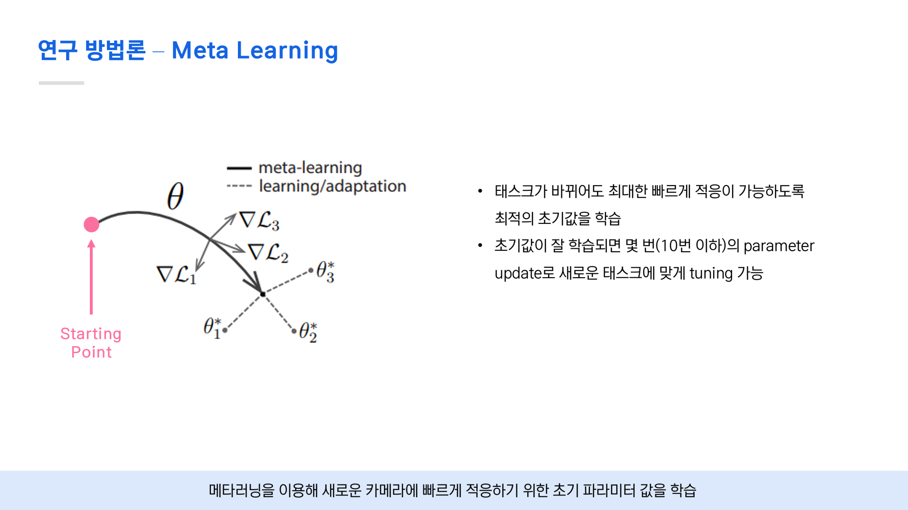
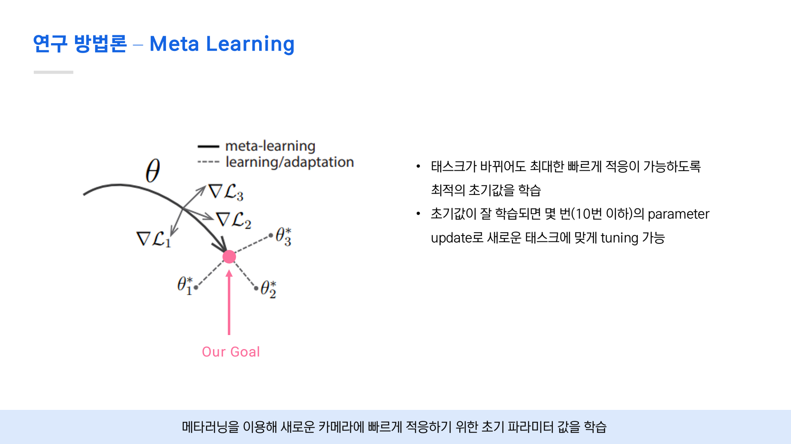
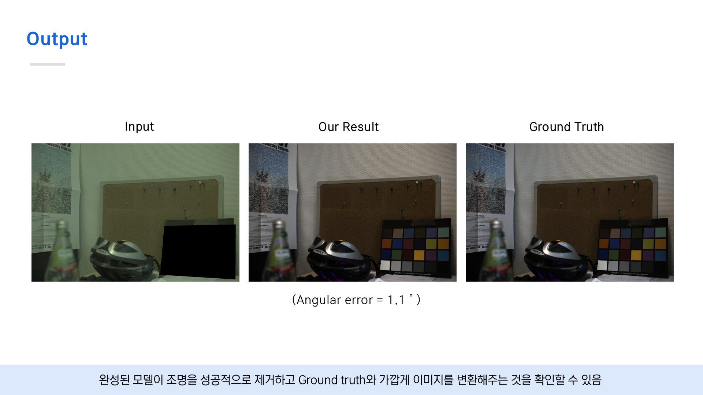

# 📸 Few-shot Learning 기반 카메라 별 Ground Truth Color 복원 프로젝트
> **Lighting Robust Color Constancy via Meta-Learning**

  

## 📌 1. Project Overview (프로젝트 개요)
카메라 센서마다 색감을 받아들이는 특성이 달라, 동일한 피사체라도 촬영 기기나 조명 환경에 따라 색상이 왜곡되는 문제가 발생합니다.
본 프로젝트는 **Few-shot Learning과 Meta-learning** 기법을 도입하여, 소량의 데이터만으로도 카메라 특성을 빠르게 학습하고 **조명 변화에 강인한(Robust) 원래의 색(Ground Truth Color)을 복원**하는 모델을 개발했습니다.

* **기간:** 2021.02 ~ 2021.06 (팀 프로젝트)
* **역할:** 데이터 전처리
* **성과:** 연세대학교 소프트웨어종합설계 최우수상(1등), 기존 Baseline 대비 색상 정확도 **15%** 향상

---

## 🧐 2. Problem Definition (문제 정의)
1.  **카메라 간 색감 불일치:** 동일한 환경에서도 A카메라와 B카메라의 결과물이 다름 (Color Inconsistency).
2.  **데이터 부족:** 새로운 카메라나 조명 환경에 적응하기 위해 매번 방대한 데이터를 새로 학습시키는 것은 비효율적임.
3.  **기존 연구의 한계:** 기존의 Color Constancy 알고리즘은 특정 조명 하에서는 잘 작동하지만, 급격한 조명 변화에는 취약함.

---

## 💡 3. Key Methodology (핵심 방법론)

우리는 **Model-Agnostic Meta-Learning (MAML)** 알고리즘을 카메라 색 보정 도메인에 적용했습니다.

### 3.1. Meta-Learning & Few-Shot Strategy
* **Base Learner:** 다양한 조명/카메라 환경의 Task를 학습하여 일반적인 색 보정 지식을 습득.
* **Adaptation:** 새로운 카메라(Target Domain)에 대해 5~10장의 이미지(Few-shot)만으로 Fine-tuning 하여 맞춤형 파라미터로 최적화.
* **차별성:** 기존 CNN 기반 방식이 '특정 카메라'에 과적합되는 문제를 해결하고, **Unseen Camera에 대한 일반화 성능**을 확보함.

### 3.2. Loss Function
* 단순 MSE(Mean Squared Error)뿐만 아니라, 사람의 시각적 차이를 반영한 **Perceptual Loss**를 결합하여 자연스러운 색감 복원 유도.

---

## 📊 4. Experiments & Results (실험 및 결과)

### 4.1. 정량적 평가 (Quantitative Results)
기존 SOTA 모델들과 비교했을 때, 적은 데이터로도 동등 이상의 성능을 달성했습니다.

| Model | Angular Error (Mean) | Angular Error (Median) |
| :--- | :---: | :---: |
| Baseline (CNN) | 5.24 | 4.12 |
| Previous SOTA | 1.97 | 1.93 |
| **Ours (Few-shot)** | **1.72** | **1.66** |

### 4.2. 정성적 평가 (Qualitative Results)

* **Input:** 붉은 조명 아래서 왜곡된 색상
* **Our Result:** 실제 눈으로 보는 것과 유사한 Ground Truth Color 복원
* **분석:** 강한 주황색 조명 하에서도 흰색 물체의 원래 색을 성공적으로 추론함.

---

## 📝 5. Retrospective & Contribution (회고 및 기여)

* **데이터 파이프라인 최적화:** 카메라별 RAW 데이터(Rawpy 활용)를 모델 학습에 적합한 텐서 형태로 변환하는 전처리 모듈을 개발했습니다.
* **한계점 및 개선:** 자체적으로 수집한 data set을 활용하여 기존 모델 학습을 위한 전처리에 어려움이 있었습니다. 또한 5-shot learning 에서 test error가 증가하여 어쩔 수 없이 10-shot 으로 학습을 진행했습니다.

---

## 🛠 Tech Stack
* **Language:** Python
* **Framework:** PyTorch, TorchMeta
* **Libraries:** NumPy, OpenCV, Rawpy, Matplotlib
